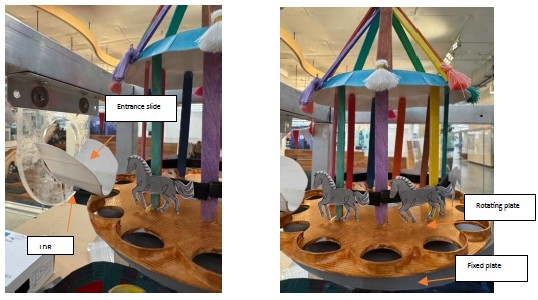
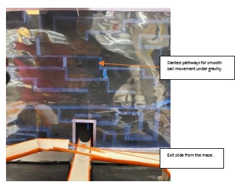
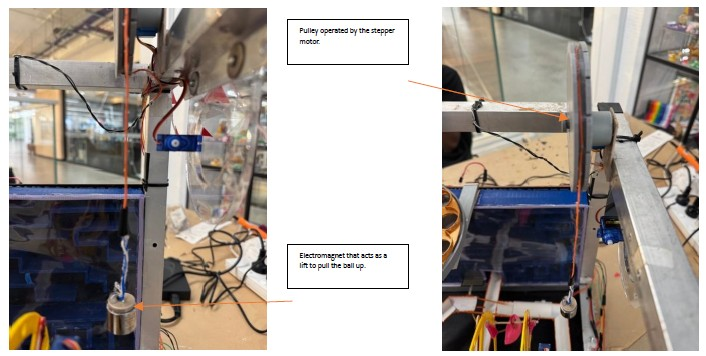

# Automated Crazy Machine Controlled by Finite State Machine (FSM)

**Mechatronics Systems Integration · Sensors · Actuators · Embedded Control**  
Curtin University — Mechatronics Engineering (Group Project)

---

## 🧠 Project Overview
Designed and implemented an automated **Rube Goldberg–style “Crazy Machine”** that transports a steel ball through multiple mechanical stages using coordinated **sensing, actuation, and finite state machine (FSM) control**.

The system was engineered as a **Moore-model FSM**, ensuring deterministic, repeatable behavior and robust integration between mechanical mechanisms and embedded control logic.

---

## 🎯 System Objective
- Transport a steel ball from entry to exit through multiple mechanical stages  
- Maintain **reliable, repeatable operation**  
- Achieve smooth sequencing using **sensor-driven state transitions**  
- Reset automatically after completion  

---

## 🏗️ Overall System Architecture
The machine is composed of multiple mechanically and electrically actuated subsystems. Each subsystem is activated only when the **correct sensor condition** is met, as dictated by the FSM.

---

## 🛠️ Mechanical & Electrical Subsystems

### Entrance & Ball Detection
- **Component:** Entrance slide  
- **Sensor:** LDR  
- **Function:** Detects ball entry and triggers system start  
---

### Merry-Go-Round & Maze
- **Actuator:** Stepper motor  
- **Sensor:** FSR at maze exit  
- **Function:** Transfers the ball into and through the maze

**Merry-Go-Round**

**Maze**

---

### Ferris Wheel Lift
- **Actuator:** Servo motor  
- **Sensor:** FSR  
- **Function:** Lifts the ball vertically to the upper level  

---

### Piston Actuation
- **Actuator:** Linear servo  
- **Function:** Pushes the ball onto the upper slide  

---

### Elevator & Electromagnet
- **Actuators:**  
  - Stepper motor (elevator)  
  - Electromagnet (ball holding)  
- **Sensor:** Line sensor  
- **Function:** Captures and lifts the ball vertically  

---

### Bridge & Exit
- **Actuator:** Servo motor  
- **Function:** Aligns bridge horizontally and releases ball to exit  

---

## 🔄 Control Architecture — FSM Design
The entire machine is governed by a **Moore finite state machine**, where outputs depend only on the current state. This approach improves predictability, avoids race conditions, and simplifies debugging.

### State Sequence Summary
- **Reset (I):** All mechanisms return to default positions  
- **Wait (A):** Ball detected at entrance using LDR  
- **Merry-Go-Round (B):** Ball transferred into maze  
- **Ferris Wheel (C):** Ball lifted after FSR detection  
- **Piston Actuation (D):** Ball pushed onto upper slide  
- **Electromagnet ON (E):** Ball captured  
- **Elevator Up (F):** Stepper motor lifts ball  
- **Bridge Align (G):** Servo rotates bridge to horizontal  
- **Release (H):** Electromagnet disengaged, ball exits  
- **Timer → Reset (I):** 3-second delay before reset  

---

## 🧪 Testing & Optimization
- Conducted repeated test runs to identify:
  - Sensor misalignment  
  - Timing mismatches  
  - Mechanical instability  
- Fine-tuned:
  - Motor speeds  
  - Sensor thresholds  
  - FSM delays and transitions  
- Achieved **consistent, repeatable ball traversal** from start to exit  

---

## ⭐ My Key Contributions
- Designed and implemented the **FSM-based control logic**
- Integrated multiple sensors (LDR, FSR, line sensors) with actuators
- Coordinated timing, sequencing, and state transitions
- Assisted with mechanical alignment to ensure reliable sensing
- Debugged timing errors and sensor misalignments
- Contributed to documentation, testing, and final demonstration

---

## 🧩 Technologies & Tools
- **Controllers:** Arduino, FPGA (Quartus)  
- **Programming:** Arduino IDE, FSM logic  
- **Sensors:** LDR, FSR, line sensors  
- **Actuators:** Stepper motors, servo motors, electromagnet, piston  
- **Design:** CAD modeling, mechanical prototyping  
- **Collaboration:** Team coordination, versioned documentation  

---

## 🤝 Team Collaboration & Project Management
- Set up shared communication channels for coordination
- Participated in early concept development and CAD refinement
- Assisted with component sourcing and lab-based assembly
- Contributed to testing, documentation, and final presentation video

---

## 🚀 Key Learnings
- FSM-based control greatly improves reliability in multi-stage mechatronic systems  
- Tight coupling between mechanical design and sensing is critical  
- Small timing and alignment errors can propagate through complex systems  
- Clear state definitions simplify debugging and integration  

---

## 🎥 Full System Demonstration
**Project Demonstration Video:**  
[Watch the full system in operation](PASTE_VIDEO_LINK_HERE)
