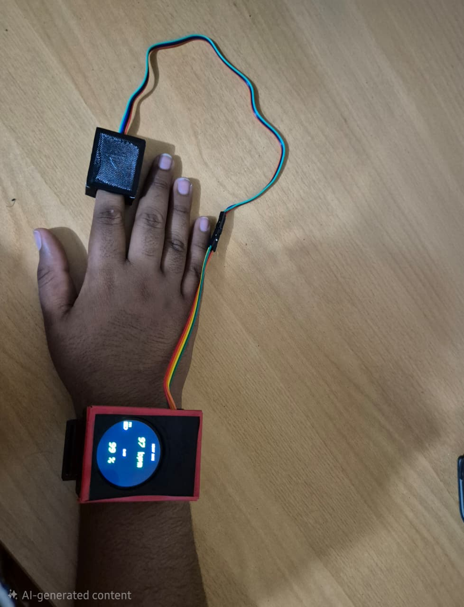

# Quality-Gated Wearable PPG System for HR & SpO₂ Telemetry

**ESP32-S3 · MAX30102 · IoT · Signal Processing · Telehealth**  
Curtin University — Mechatronics Engineering

---

## 🧠 Overview
Designed and validated a low-cost wearable photoplethysmography (PPG) system for continuous heart rate (HR) and oxygen saturation (SpO₂) monitoring, with on-device signal quality gating and cloud-based telemetry for remote wellness tracking.

The core engineering focus was preventing physiologically invalid or noisy data from reaching cloud dashboards — a common failure mode in basic wearable systems.

---

## 🛠 System Description
- Finger-based reflective PPG wearable using a **MAX30102** sensor
- **ESP32-S3** microcontroller with onboard display
- Custom light-shielded enclosure for improved optical stability
- Autonomous Wi-Fi telemetry to a private ThingSpeak channel

---

## ⭐ Key Engineering Contributions
- Structured sensor parameter tuning (ADC range, LED current, sample averaging)
- Identification and mitigation of harmonic locking not caught by vendor libraries
- Multi-stage real-time data quality gating:
  - Vendor signal validity flags
  - HR continuity rule (|ΔHR| ≤ 20 bpm)
  - Physiological plausibility limits (HR 40–200 bpm, SpO₂ 70–100%)
- Causal EMA smoothing (α = 0.10) for HR trend stabilization
- Cloud-aware upload gating at a fixed 16 s cadence

---

## 📊 Performance & Validation
Validated against a clinical reference oximeter at rest:

- **Heart Rate**
  - Mean bias: +3.9 bpm
  - 95% LoA: −2.8 to +10.5 bpm
- **SpO₂**
  - Mean bias: −0.74 percentage points
  - 95% LoA: −3.6 to +2.1 pp
- **Data acceptance rate:** >95% valid windows

Performance was comparable to consumer-grade wearables, with significantly improved reliability due to on-device quality gating.

---

## 🧩 Technologies Used
- ESP32-S3, MAX30102
- Embedded C/C++, I²C, UART
- Signal processing (EMA filtering, plausibility gating)
- Wi-Fi telemetry, HTTP, ThingSpeak
- 3D-printed light-shielded enclosure
- Bland–Altman analysis, RMSE, bias metrics

---
## 📷 Prototype & Architecture

  

  

## 📈 Validation Results

## 🚀 Future Improvements
- MQTT over TLS for secure communication
- Accelerometer-based motion artefact suppression
- On-device ML for anomaly detection and adaptive filtering
